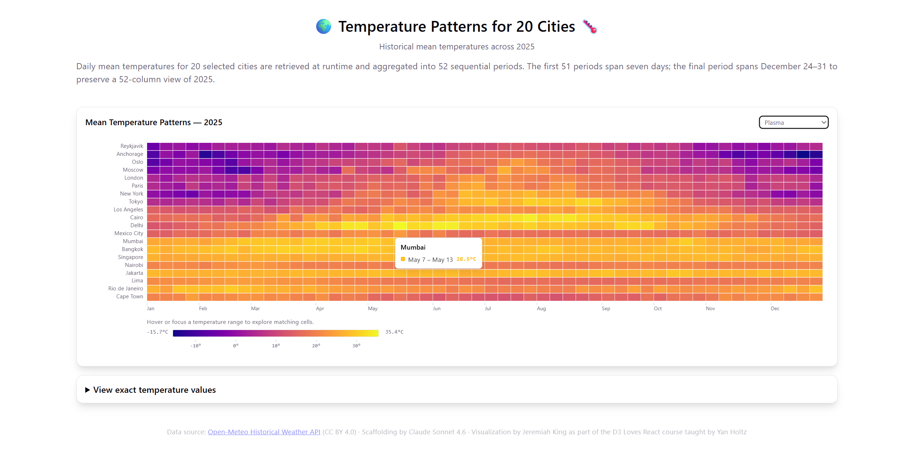

# Heatmap Dashboard

This D3 Loves React learning exercise visualizes 2025 historical mean temperatures for 20 selected cities using React, D3, and data from Open-Meteo.

## Live demo

https://unguisdraconis.github.io/heatmap-dashboard/



## What it demonstrates

- Runtime historical-data retrieval
- Daily-to-period temperature aggregation
- React and D3 composition for an SVG heatmap
- Responsive chart sizing
- Temperature color scales, palettes, and pointer tooltips
- An interactive temperature legend used as the primary interface for exploring patterns across the heatmap
- A structured exact-value alternative

## Data scope and method

The browser requests `temperature_2m_mean` from the [Open-Meteo Historical Weather API](https://open-meteo.com/en/docs/historical-weather-api) for 20 selected cities from January 1 through December 31, 2025. The API determines each location's timezone, and the displayed values use its default Celsius unit.

Daily mean temperatures are aggregated into 52 sequential displayed periods. The first 51 periods span seven days; the final period spans December 24–31, an eight-day period that preserves the 52-column year layout.

The repository does not contain a frozen weather-data snapshot. Values are requested at runtime and may change if the provider revises its historical data.

## Data provenance

Source weather data are provided by Open-Meteo under [CC BY 4.0](https://creativecommons.org/licenses/by/4.0/). This data license does not license the repository software; no separate software license is currently specified.

## Learning and AI context

The project was created as part of **D3 Loves React**, taught by **Yan Holtz**. Scaffolding is credited to **Claude Sonnet 4.6**, and the visualization is credited to **Jeremiah King**.

## Local use

```text
npm install
npm run dev
npm run build
```

## Accessibility and limitations

- The temperature legend is intentionally the primary exploratory interface. Pointer hover and keyboard focus operate the same range-highlighting behavior, while a secondary structured table provides exact values. This preserves Jeremiah King's minimalist design intent.
- Individual heatmap cells and their tooltips remain pointer-oriented.
- The 20 cities are a selected sample, not comprehensive global coverage.
- Runtime historical values are not a frozen reproducible snapshot.
- Further browser and assistive-technology testing remains appropriate; this project does not claim WCAG conformance.
